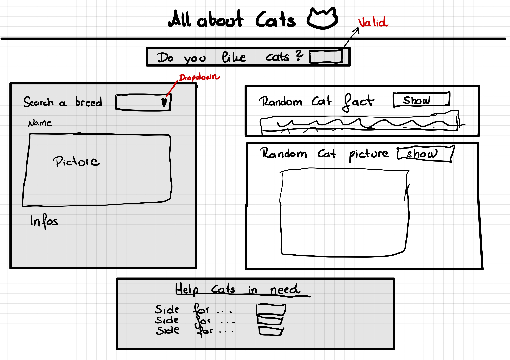

##**ALL ABOUT CATS**

###Short description
####A website where you can generate random catfacts, random catpictures and search for breed information.At the end you find different websites to help cats in need. A simple question (validation) checks whether you are allowed to act with the site.

###Vorgehensweise

1. Search APIs -> done
2. Mockup ->done
3. HMTL layout ->done
4. Headline with picture -> done
5. Catfacts -> done -> fetch data from (URL: https://catfact.ninja/fact?max_length=140)
6. Random Cat picture -> done -> fetch data from (URL:https://api.thecatapi.com/v1/images/search) and set the picture attributes
7. Breed search -> get data with Vue from (URL:https://api.thecatapi.com/v1/breeds ) (in HTMLfile and SearchBreeds.js) 
8. Validierung -> done -> if "YES" you have access to the side. Anything else will show a picture in front of everything so you aren't allowed to use the side. You need to write the keyword always. The image is implemented in the 
if of the functionhandler
9. Help cats in need link search -> done
10. Help cats in need impl -> done, listgroup, You click on the short description and you will be guided to the described side

--APIS--
+ https://api.thecatapi.com/v1/breeds
+ https://catfact.ninja/fact?max_length=140
+ https://api.thecatapi.com/v1/images/search

--Cats in Need--
+ https://www.strayz.de/ -> help strays
+ https://www.katzplatz.at/tiertafel-kaernten/helfer-werden/
+ http://www.tierschutz-kaernten.at/wie-kann-ich-helfen/

--What is Vue and Vuetify?--

Vue.js is a JavaScript framework for building user interfaces, 
while Vuetify is a UI component library based on Vue.js 
that provides pre-built UI components in the Material Design style. 
Vue.js provides the basic structure and logic of the application, 
while Vuetify facilitates the development of responsive user interfaces 
by offering ready-to-use components.
So, Vue.js gives you the building blocks and functionality, 
while Vuetify enhances your application's visual appearance and user 
experience by offering a wide range of ready-to-use and aesthetically 
pleasing UI components.
https://vuetifyjs.com/en/introduction/why-vuetify/